# Gradu8

A Unity project made for NUS Orbital 2017.

The Project is build primarily for Android devices, but an exe files for PC is available as well. Spacebar is used for jumping in the exe version.

Android packaged download available in `Gradu8_Apk` folder. PC executable version available in `Gradu8_exe.zip` folder.

## Promotional Poster
The idea came about as I spent 1 year in school and felt that it was like a race against time with deadlines and assignments always breathing down your neck. With that in mind, we decided to create a game based on this premise because why not ~.~ . It is made with unity and is summarized by the poster shown below.

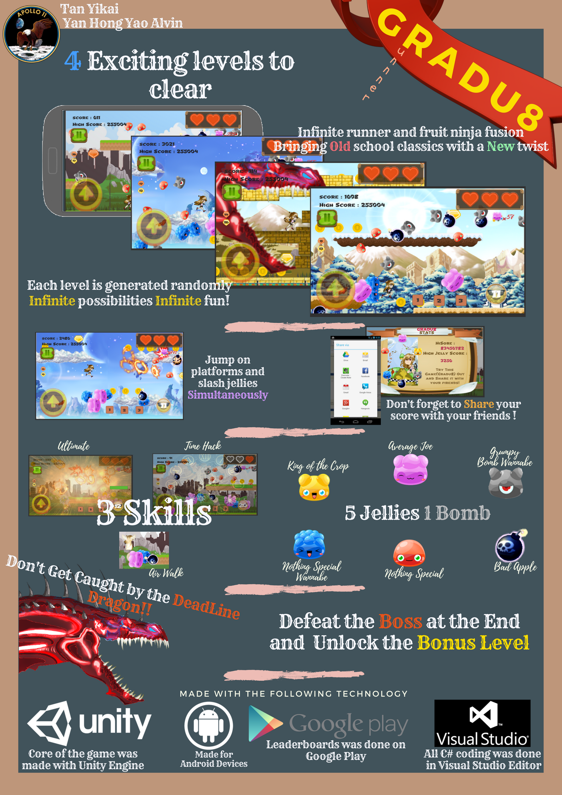
*Promotional poster*

## Game Overview
At the start of the game, you can either sign in with your google play account for the leader boards score or just skip the whole sign in and play for fun without any score tracking.

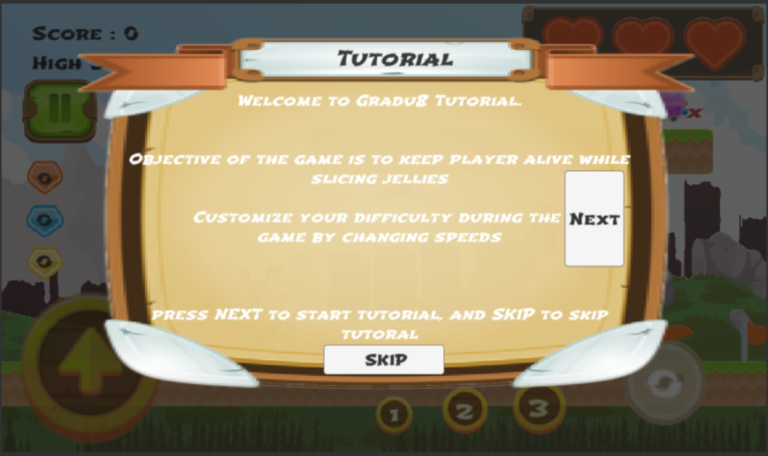 
*Tutorial stage*

 

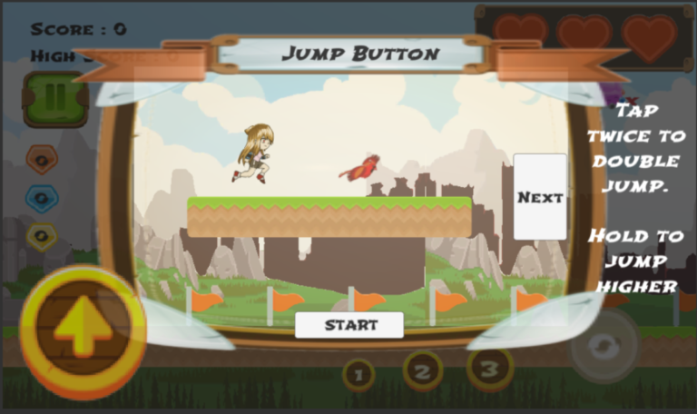 

 

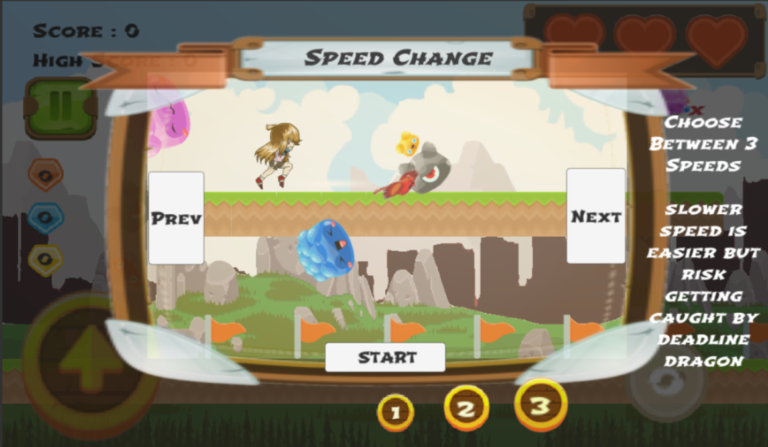 

 

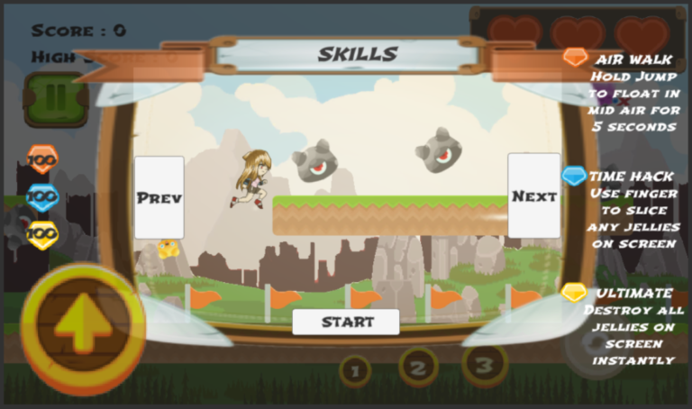 

 

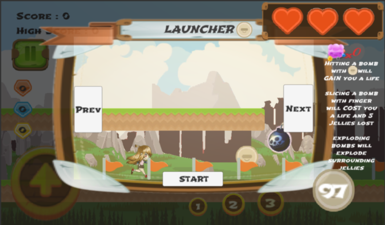 

 

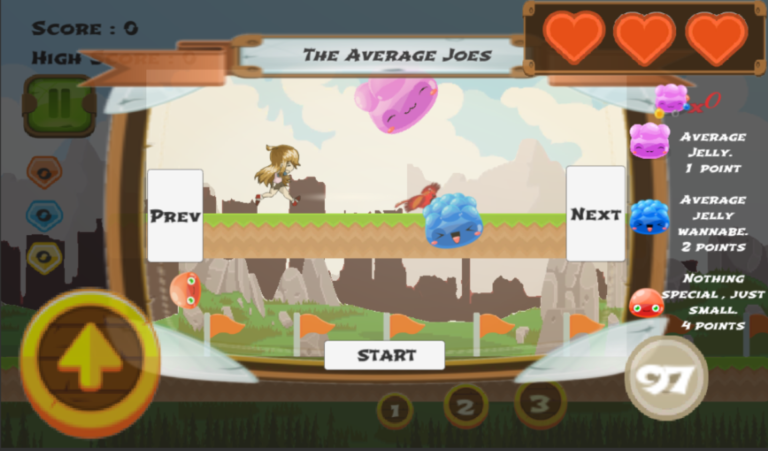 

 

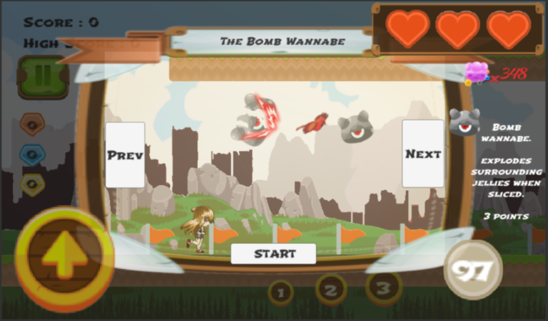 

 

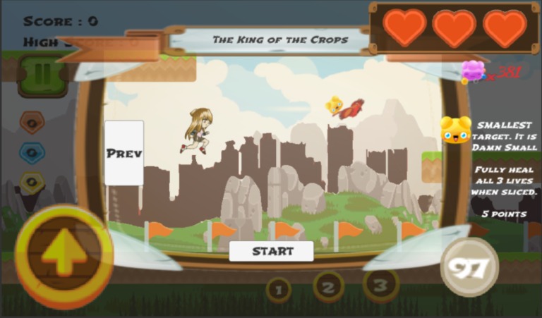 

 
 

### Game Tutorial
Upon clicking the play button, you are greeted with the tutorial. Of course like most tutorials, it is skip-able if you wish to.

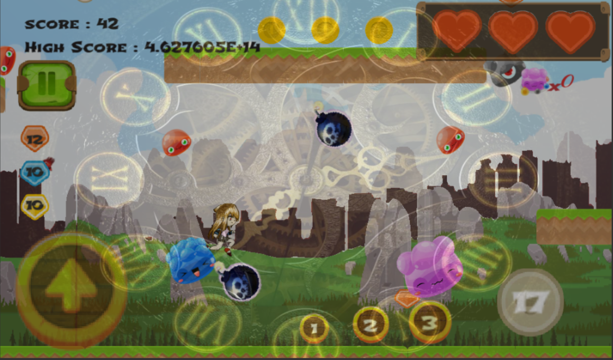 
*Time Hack*

 

### Skills
There are 3 skills that you can use and they can be activated by touching the red, blue or yellow gems at the left of the screen.

The red gem activates Wind Walk for 5 seconds. During this time, you can float through the air by tapping the jump button. 

 
*Wind Walk*

 

The blue gem activates the Time Hack. For 5 seconds, all time stops. You can however still slash any jellies during this period of time.

 
*Time Hack*

 

Finally, the gold gem activates the Ultimate. This destroys any jellies on the screen instantly. It also destroys any bombs without you having to lose a life. This skill can only be gained by slashing an elusive tiny Gold jelly.

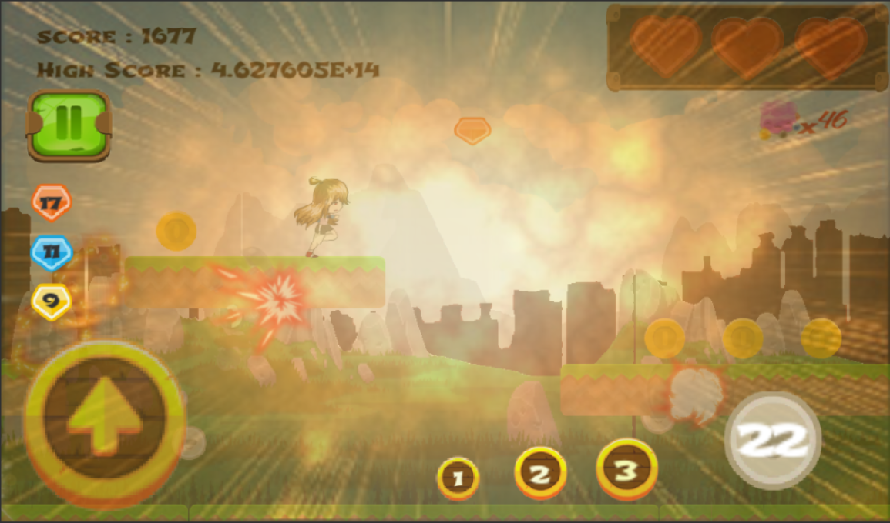 
*Ultimate*

 

### Levels
There are a total of 4 levels to be cleared, each levels has their respective objective to clear before being able to move on to the next stage.

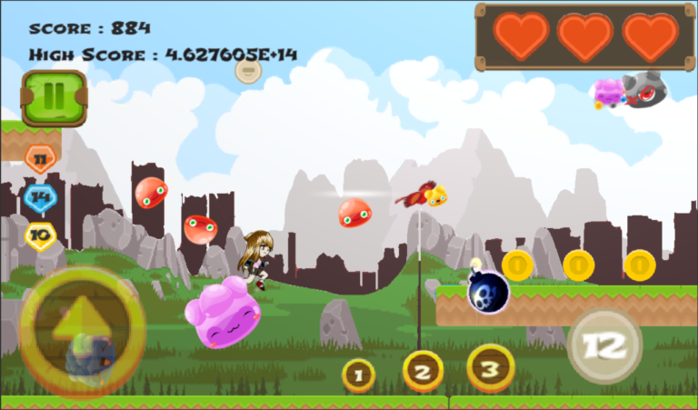 
*Level 1*

 

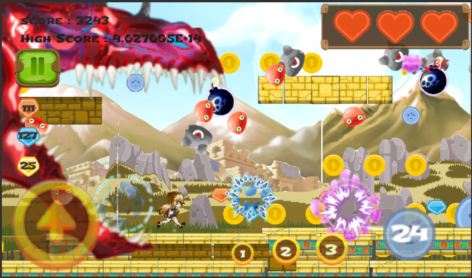 
*Level 2*

 

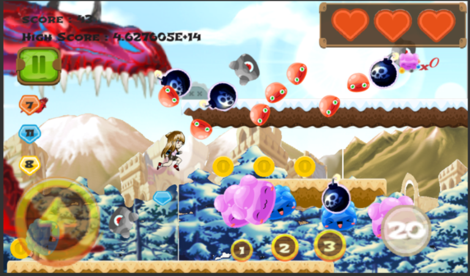 
*Level 3*

 

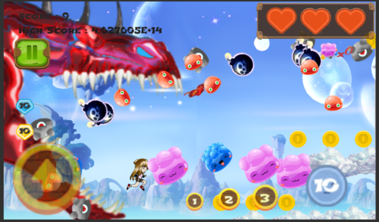 
*Level 4*

 

Upon clearing all 4 stages, you will finally be able to confront the boss – The Deadline Dragon! Use your Launcher to hit the Deadline Dragon.

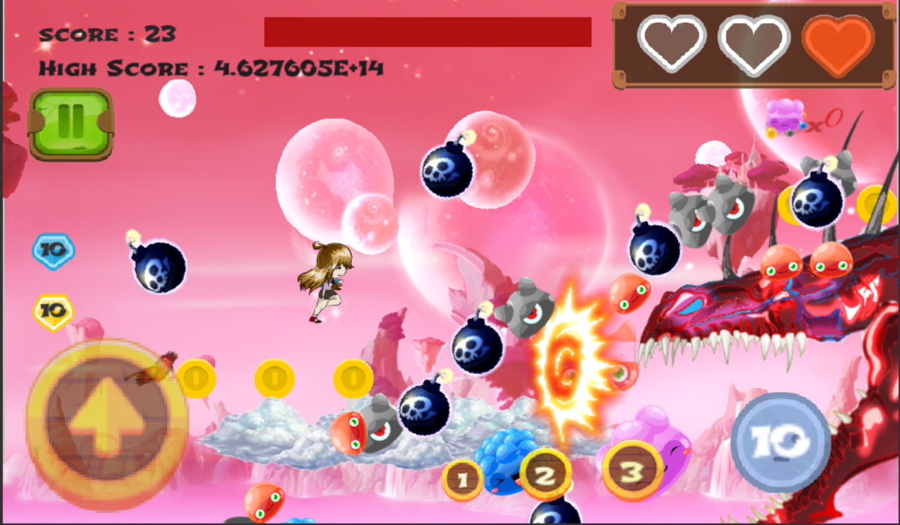 
*Boss Level*

 

Finally after all that adventure and trial, if you managed to defeat the Deadline Dragon, you are entitled to enter the Bonus stage! In the Bonus stage, you won’t get instantly killed as there are no Deadline Dragon nor fall off pits to kill you. Here you are allowed to slash all the jellies to your hearts content and earn all those sweet sweet scores!

 
*Bonus Level*